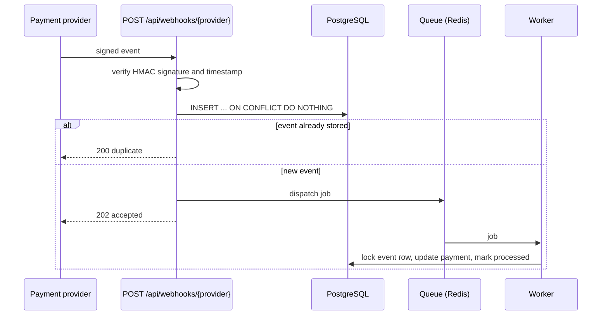

# payment-webhooks

Laravel service that receives payment webhooks: signed, idempotent, queued, safe against late and out-of-order events.

[](https://github.com/steponavichus/payment-webhooks/actions/workflows/ci.yml)


> [!NOTE]
> A demonstration project, not a production system. Built with the help of Claude Code, an AI coding assistant.
> Every behaviour described below is covered by automated tests that run in CI.

Real output of the bundled script against a running instance (a new event, the same event again, a wrong secret, then a refund):

```text
$ scripts/send-webhook.sh payment.succeeded pay_1 1500 USD evt_001
{"status":"accepted","event_id":1}
HTTP 202                                  # stored, job queued

$ scripts/send-webhook.sh payment.succeeded pay_1 1500 USD evt_001
{"status":"duplicate"}
HTTP 200                                  # provider retried, nothing is processed twice

$ WEBHOOK_SECRET=wrong scripts/send-webhook.sh payment.succeeded pay_2 900 USD evt_002
{"message":"Invalid signature."}
HTTP 401                                  # nothing stored

$ scripts/send-webhook.sh payment.refunded pay_1 500 USD evt_003
{"status":"accepted","event_id":3}
HTTP 202

# after the worker ran: payment pay_1 has amount 1500, refunded_amount 500, status partially_refunded
```

## Why this exists

Payment providers deliver webhooks *at least once*: the same event can arrive twice, events can arrive out of order,
and the provider expects an answer within seconds. A naive handler double-charges, times out, trusts forged requests
or loses events when the queue is down. This project shows one way to handle each of these problems.

## How it works



| Problem | Solution | Code |
|---|---|---|
| Forged requests | HMAC-SHA256 over `timestamp.body`, constant-time comparison | `SignatureVerifier`, `VerifyWebhookSignature` |
| Replayed requests | The timestamp is part of the signature and must be within 5 minutes | `SignatureVerifier` |
| Secret rotation | Several valid secrets per provider at once | `config/webhooks.php` |
| Duplicate deliveries | Unique `(provider, event_id)` plus one atomic insert; duplicates get `200` | `WebhookController` |
| Provider timeouts | The request only stores the event and queues a job, answer is `202` | `WebhookController` |
| Duplicate or concurrent jobs | Row lock and a check of the final status | `ProcessWebhookEvent` |
| Temporary failures | 5 attempts with backoff of 10, 30, 60 and 120 seconds | `ProcessWebhookEvent` |
| Refund arrives before the payment | Retried until the payment exists | `PaymentEventProcessor` |
| Late `failed` or `succeeded` event | Never overwrites a captured payment or undoes a refund | `PaymentEventProcessor` |
| Impossible event (refund above the amount) | Fails at once without retries, with a readable `last_error` | `PaymentEventProcessor` |
| Event stored but never queued (queue was down) | `webhooks:redispatch` runs every minute and queues it again | `RedispatchWebhookEvents` |

Event statuses: `received` → `processing` → `processed`, `ignored` (unknown event type) or `failed`.
Amounts are stored as integers in minor units (cents).

## Quick start

```bash
docker compose up --build
```

In another terminal, send a signed event and a partial refund:

```bash
export WEBHOOK_SECRET=whsec_demo_local_only
scripts/send-webhook.sh payment.succeeded pay_1 1500 USD
scripts/send-webhook.sh payment.refunded  pay_1 500
```

The stack contains the web app, a queue worker, the scheduler, PostgreSQL and Redis.
If port 8000 is already taken, run `APP_PORT=8080 docker compose up --build` and set
`WEBHOOK_URL=http://localhost:8080/api/webhooks/demo` for the script.

<details>
<summary>Without Docker (PHP 8.3+, SQLite)</summary>

```bash
composer setup
echo "WEBHOOK_DEMO_SECRETS=dev-secret" >> .env

php artisan serve &
php artisan queue:work &

export WEBHOOK_SECRET=dev-secret
scripts/send-webhook.sh payment.succeeded pay_1 1500 USD
```

Look at the result:

```bash
php artisan tinker --execute='dump(App\Models\Payment::all(["payment_id", "amount", "refunded_amount", "status"])->toArray(), App\Models\WebhookEvent::all()->mapWithKeys(fn ($e) => [$e->event_id => $e->status->value])->toArray());'
```

SQLite is for a quick look only: Laravel's SQLite grammar ignores `lockForUpdate()`, so the row lock described below needs PostgreSQL (or MySQL).

</details>

## API

`POST /api/webhooks/{provider}` (the bundled provider is `demo`)

Headers: `Content-Type: application/json`, `X-Webhook-Signature: t=<unix time>,v1=<hex hmac>`

```json
{
  "id": "evt_123",
  "type": "payment.succeeded",
  "created": 1790000000,
  "data": { "payment_id": "pay_1", "amount": 1500, "currency": "USD" }
}
```

Supported types: `payment.succeeded`, `payment.failed`, `payment.refunded` (`data.amount` is the refunded amount).
Other types are stored and marked `ignored`.

| Response | Meaning |
|---|---|
| `202` | New event stored and queued |
| `200` `{"status":"duplicate"}` | Event was already received, nothing is done again |
| `401` | Missing, wrong or stale signature |
| `404` | Unknown provider |
| `422` | Valid signature, malformed payload |

The signature is `HMAC_SHA256(secret, "<timestamp>.<raw body>")`, hex encoded. The scheme resembles the one used by Stripe,
but this is a generic demo and not any provider's real API. A real integration needs a verifier for that provider's format.

## Design decisions and trade-offs

| Decision | Why | Cost |
|---|---|---|
| Store the event first, process it in a job | The provider gets an answer in milliseconds and does not retry because of a timeout | Processing is eventually consistent; an event can be stored but never queued (handled by `webhooks:redispatch`) |
| Idempotency in the database (unique `(provider, event_id)`, one atomic insert) | Survives restarts and cache flushes; two concurrent deliveries cannot both win | Every delivery touches the database; old events need pruning (not implemented) |
| Row lock inside a transaction, not a Redis lock | No extra infrastructure; the lock is released with the transaction | Needs PostgreSQL or MySQL; the lock is held while the event is processed, so processing must stay short |
| Impossible events fail at once, without retries | Retrying a refund above the payment amount can never succeed | Someone has to look at `failed` events; there is no replay command yet |
| Secrets in a comma-separated environment variable, several at once | Rotation without downtime: add the new secret, switch the provider, remove the old one | Changing a secret needs a config reload; no per-tenant secrets stored in the database |
| A refund that arrives before its payment is retried | Needs no extra state or reordering buffer | The retry window is about 220 seconds (10 + 30 + 60 + 120); a payment event later than that makes the refund fail |

## Security model

- The signature is checked in a middleware, before the payload is parsed or stored. A request with a bad signature changes nothing.
- The signed string is `<timestamp>.<raw body>`: the exact bytes received, so re-encoding the JSON cannot break or bypass the check.
- A timestamp older or newer than 5 minutes (`WEBHOOK_TOLERANCE`) is rejected, which limits replay of a captured request.
- Signatures are compared with `hash_equals` (constant time).
- An unknown provider and a provider without secrets both answer `404`, so the response does not reveal which providers are configured.
- `last_error` is cut to 1000 characters.
- The secret in `docker-compose.yml` is for local use only. Real secrets belong in the environment, not in the repository.

## Tests and quality

```bash
composer check   # Laravel Pint, PHPStan level 8 (Larastan), PHPUnit
```

- Unit tests for signature verification: tampering, wrong secret, old and future timestamps, rotation, malformed headers.
- Feature tests for the HTTP endpoint, the job (idempotency, ordering, failures) and the redispatch command.
- CI runs Pint and PHPStan, then the test suite on PHP 8.3, 8.4 and 8.5, each with SQLite and with PostgreSQL 17.

## Project layout

```text
app/Http/Controllers/WebhookController.php     receive, validate, store, queue
app/Http/Middleware/VerifyWebhookSignature.php signature check before the controller
app/Webhooks/SignatureVerifier.php             HMAC and timestamp logic, no framework dependencies
app/Webhooks/PaymentEventProcessor.php         applies events to payments
app/Jobs/ProcessWebhookEvent.php               queue job: lock, process, retry, fail
app/Console/Commands/RedispatchWebhookEvents.php
scripts/send-webhook.sh                        signs and sends a test event
```

## Limitations

This is a demonstration. Known gaps and what I would do in production:

- Only the `demo` provider exists. A real provider needs its own signature verifier and payload mapping.
- `failed` events cannot be replayed. Add a command or a UI for it.
- There is no cleanup of old events. Add pruning by age.
- No rate limiting and no request size limit. Usually set at the proxy.
- No metrics or alerts for failed events and queue lag.
- Events are applied in arrival order, not by the provider's event time. Use the provider's ordering where it guarantees one.
- The row lock does not work on SQLite (see above); concurrency behaviour is only meaningful on PostgreSQL.

## License

MIT
