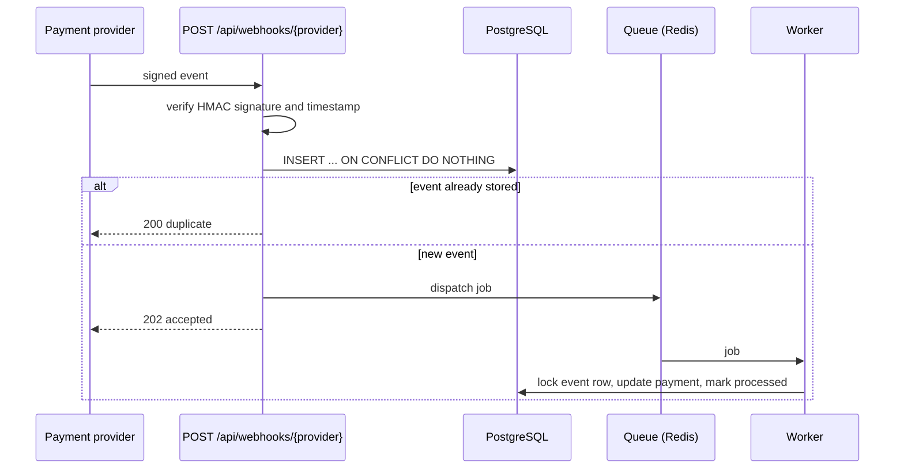

# payment-webhooks

[](https://github.com/steponavichus/payment-webhooks/actions/workflows/ci.yml)

A small Laravel service that receives payment webhooks the way a payment system should be integrated:
signed requests, no duplicate processing, fast responses, retries, and correct behaviour when events arrive late or out of order.

> Built with the help of Claude Code, an AI coding assistant, as a demonstration project.
> Every behaviour described below is covered by automated tests that run in CI.

## Why this exists

Payment providers deliver webhooks *at least once*: the same event can arrive twice, events can arrive out of order,
and the provider expects an answer within seconds. A naive handler double-charges, times out, trusts forged requests
or loses events when the queue is down. This project shows one way to handle each of these problems.

## How it works



| Problem | Solution | Code |
|---|---|---|
| Forged requests | HMAC-SHA256 over `timestamp.body`, constant-time comparison | `SignatureVerifier`, `VerifyWebhookSignature` |
| Replayed requests | The timestamp is part of the signature and must be within 5 minutes | `SignatureVerifier` |
| Secret rotation | Several valid secrets per provider at once | `config/webhooks.php` |
| Duplicate deliveries | Unique `(provider, event_id)` plus one atomic insert; duplicates get `200` | `WebhookController` |
| Provider timeouts | The request only stores the event and queues a job, answer is `202` | `WebhookController` |
| Duplicate or concurrent jobs | Row lock and a check of the final status | `ProcessWebhookEvent` |
| Temporary failures | 5 attempts with backoff of 10, 30, 60 and 120 seconds | `ProcessWebhookEvent` |
| Refund arrives before the payment | Retried until the payment exists | `PaymentEventProcessor` |
| Late `failed` or `succeeded` event | Never overwrites a captured payment or undoes a refund | `PaymentEventProcessor` |
| Impossible event (refund above the amount) | Fails at once without retries, with a readable `last_error` | `PaymentEventProcessor` |
| Event stored but never queued (queue was down) | `webhooks:redispatch` runs every minute and queues it again | `RedispatchWebhookEvents` |

Event statuses: `received` → `processing` → `processed`, `ignored` (unknown event type) or `failed`.
Amounts are stored as integers in minor units (cents).

## Quick start

### With Docker

```bash
docker compose up --build
```

In another terminal, send a signed event and a partial refund:

```bash
export WEBHOOK_SECRET=whsec_demo_local_only
scripts/send-webhook.sh payment.succeeded pay_1 1500 USD
scripts/send-webhook.sh payment.refunded  pay_1 500
```

The stack contains the web app, a queue worker, the scheduler, PostgreSQL and Redis.

If port 8000 is already taken on your machine, pick another one:

```bash
APP_PORT=8080 docker compose up --build
export WEBHOOK_URL=http://localhost:8080/api/webhooks/demo
```

### Without Docker (PHP 8.3+, SQLite)

```bash
composer setup
echo "WEBHOOK_DEMO_SECRETS=dev-secret" >> .env

php artisan serve &
php artisan queue:work &

export WEBHOOK_SECRET=dev-secret
scripts/send-webhook.sh payment.succeeded pay_1 1500 USD
```

Look at the result:

```bash
php artisan tinker --execute='dump(App\Models\Payment::all(["payment_id", "amount", "refunded_amount", "status"])->toArray(), App\Models\WebhookEvent::all()->mapWithKeys(fn ($e) => [$e->event_id => $e->status->value])->toArray());'
```

## API

`POST /api/webhooks/{provider}` (the bundled provider is `demo`)

Headers: `Content-Type: application/json`, `X-Webhook-Signature: t=<unix time>,v1=<hex hmac>`

```json
{
  "id": "evt_123",
  "type": "payment.succeeded",
  "created": 1790000000,
  "data": { "payment_id": "pay_1", "amount": 1500, "currency": "USD" }
}
```

Supported types: `payment.succeeded`, `payment.failed`, `payment.refunded` (`data.amount` is the refunded amount).
Other types are stored and marked `ignored`.

| Response | Meaning |
|---|---|
| `202` | New event stored and queued |
| `200` `{"status":"duplicate"}` | Event was already received, nothing is done again |
| `401` | Missing, wrong or stale signature |
| `404` | Unknown provider |
| `422` | Valid signature, malformed payload |

The signature is `HMAC_SHA256(secret, "<timestamp>.<raw body>")`, hex encoded. The scheme resembles the one used by Stripe,
but this is a generic demo and not any provider's real API. A real integration needs a verifier for that provider's format.

## Tests and quality

```bash
composer check   # Laravel Pint, PHPStan level 8 (Larastan), PHPUnit
```

- Unit tests for signature verification: tampering, wrong secret, old and future timestamps, rotation, malformed headers.
- Feature tests for the HTTP endpoint, the job (idempotency, ordering, failures) and the redispatch command.
- CI runs the suite on PHP 8.3, 8.4 and 8.5, each with SQLite and with PostgreSQL 17.

## Project layout

```text
app/Http/Controllers/WebhookController.php     receive, validate, store, queue
app/Http/Middleware/VerifyWebhookSignature.php signature check before the controller
app/Webhooks/SignatureVerifier.php             HMAC and timestamp logic, no framework dependencies
app/Webhooks/PaymentEventProcessor.php         applies events to payments
app/Jobs/ProcessWebhookEvent.php               queue job: lock, process, retry, fail
app/Console/Commands/RedispatchWebhookEvents.php
scripts/send-webhook.sh                        signs and sends a test event
```

## Limitations

This is a demonstration, not a production system. For production I would add:

- a signature verifier per real provider and per-provider payload mapping;
- a command or UI to replay `failed` events;
- rate limiting and a request size limit (usually at the proxy);
- metrics and alerts for failed events and queue lag;
- ordering by the provider's event time where the provider guarantees it.

## License

MIT
